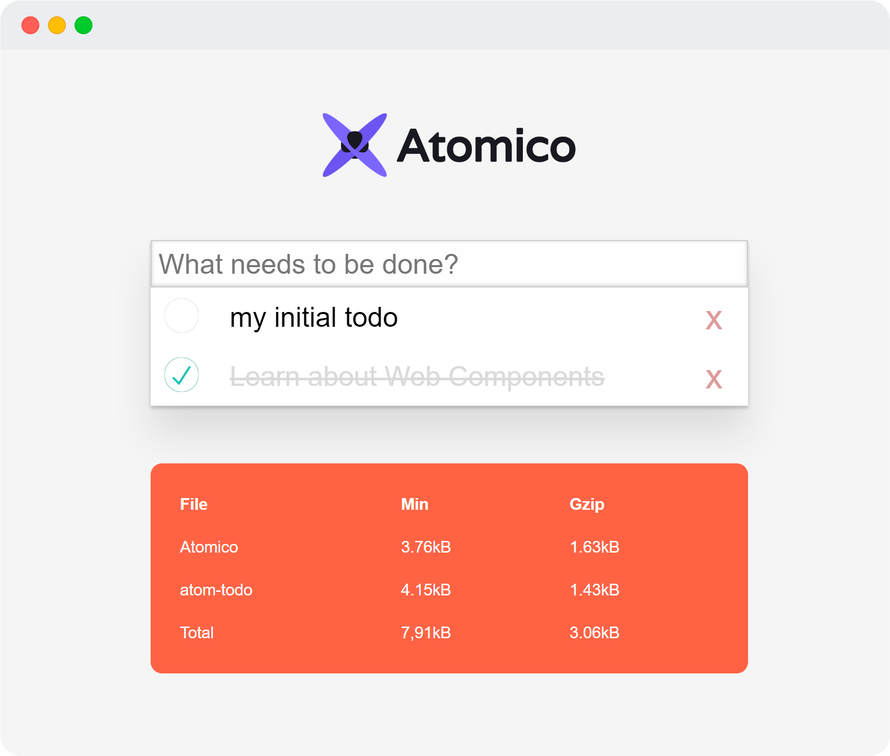

# atomico-todo

This is a small example of a component generated with [**Atomico**](https://github.com/uppercod/atomico) and packaged thanks to [**Rollup**](https://rollupjs.org/guide/en)

As learning of the use of Atomico i invite you to see explore the directory **/src**.

|File|Min|Gzip|
|----|---|----|
|Atomico|	3.76kB|	1.63kB|
|atom-todo|	4.15kB|	1.43kB|
|Total|	7,91kB|	3.06kB|

